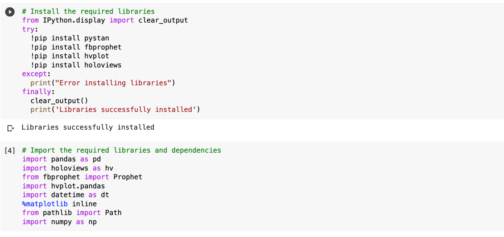

# Mercado_Libre_search_traffic_prediction
Can search traffic prediction translate into the ability to successfully trade the stock?

This project analyses MercadoLibre - the most popular e-commerce site in Latin America. It scrutinizes the company's financial and user data and searches for ways to make the company grow. 
This  Jupyter notebook  contains your data preparation, analysis, and visualizations for all the time series data that the company needs to understand i.e:

* Visual depictions of seasonality (as measured by Google Search traffic) that are of interest to the company.

* An evaluation of how the company’s stock price correlates to its Google Search traffic.

* A Prophet forecast model that can predict hourly user search traffic.

 * A plot of a forecast for the company’s future revenue.

## Dataset
The data that is being analysed is being read from the CSV files and contains the:

* Google hourly search trends for MercadoLibre

* Mercado daily revenue 

 * Mercado stock price 

## Technologies 
This project leverages python 3.7 with the following packages:
* Pandas - for financial calculations
* Path - for identifying the file
* Matplotlib - for creation of visual graphs
* numpy- for more complex mathematical calculations
* Prophet - open source library for time series analysis
* hvplot - for dynamic visualisations

## Installation guide and required libraries and dependencies 
Thsi project  is being run in the Google colab cloud and leverages python 3.7 with the following dependencies. In order to run the project the following libraries needs to be installed in the cloud by running the folllowing code in the notebook.

## Usage 

Google Search Trends for Mercado Libre

-  - -
Correlation between Google Lagged Search Trends, Stock Volatility and Hourly Stock Return

- - -
The individual time series components of the model forecasting Mercado search traffic trends

- - - 

MercadoLibre Daily sales 

- - - 
The individual time series components of the model forecasting Mercado daily sales 

- - -

## Contributors
Brought to you by Ksenia Gorska as part of the UC Berkeley Extension Bootcamp: UCB-VIRT-FIN-PT-06-2021-U-B-MW Ksenia Gorska
 e-mail: kseniagorska@icloud.com 
[linkedin] (https://www.linkedin.com/in/ksenia-gorska/)

## License

MIT

